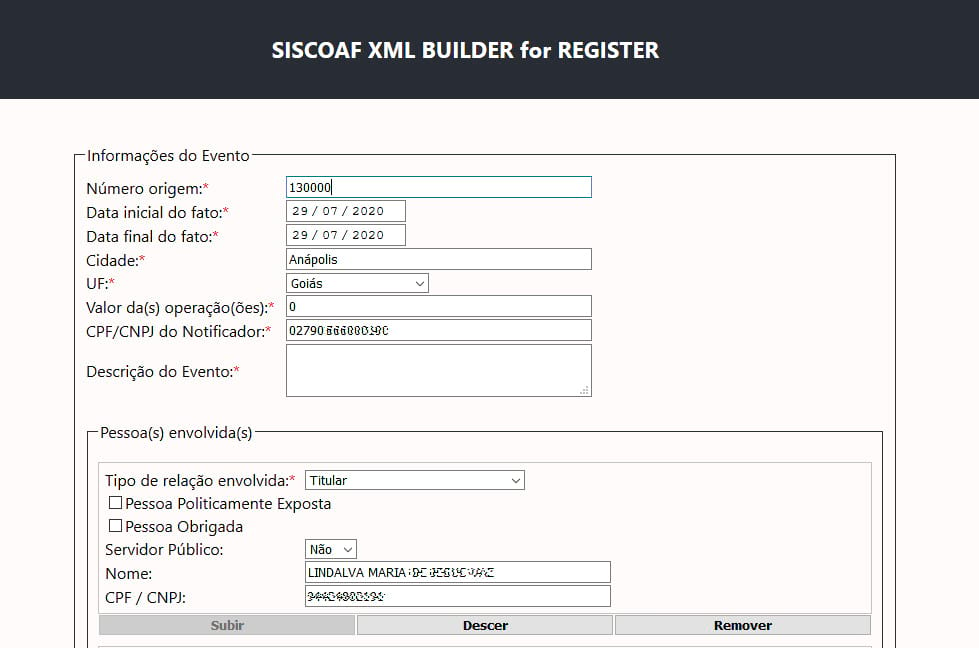

# **siscoaf-xml-builder-for-register**



Construa XML para o SISCOAF a partir do Escriba Register

## **O que é?**

Uma ferramenta simples para coletar informações de protocolos do software Escriba Register e gerar um lote XML compatível com o SISCOAF.

## **Para quem é?**

Para cartórios que utilizam o Escriba Register e ainda não tem outra forma de gerar os comunicados para o SISCOAF senão pela interface do próprio SISCOAF, ou que estão insatisfeitos com os sistemas que estão utilizando.

## **Por que?**

Quando o desenvolvimento deste aplicativo foi iniciado, a Escriba, desenvolvedora do software Register, não havia disponibilizado qualquer ferramenta para facilitar a comunicação com o SISCOAF em seus sistemas.

Finalmente uma ferramenta foi disponibilizada dentro do register, todavia, até o momento, essa ferramenta somente permite fazer os comunicados caso o registro relacionado seja finalizado.

Essa limitação faz com que vários comunicados de suspeitas de fraudes não possam ser produzidos pela própria ferramenta da Escriba, fazendo com que os usuários voltem a ter que gerar a comunicação por outros meios.

O `SISCOAF XML BUILDER` existe para atuar nessa lacuna deixada pela Escriba, possibilitando aos usuários a criação de um lote XML de comunicação a partir das informações existentes em qualquer protocolo do Register.

## **Quais as limitações?**

O `SISCOAF XML BUILDER` buscará no Register o protocolo informado pelo usuário e retornará um XML contendo:

- a data e o valor da escritura (se) informada na recepção do registro;
- a lista das partes (pessoas) relacionadas no protocolo (nome e CPF/CNPJ).

Somente!

Além disso, este aplicativo somente gera XML de **comunicação** ao SISCOAF! Retificações e outros estão fora do escopo, no momento.

## **Como instalar?**

Primeiramente, assegure-se que o `NodeJS versão 14 LTS`, o `Yarn versão 1.22 ou superior` e o `openssl` estão instalados.

Então:

1. Clone o repositório
   ```bash
   git clone https://github.com/fmartins-andre/siscoaf-xml-builder-for-register.git
   ```
2. Entre na pasta do projeto, crie o arquivo de ambiente e gere a chave e o certificado SSL:
   ```bash
   cd siscoaf-xml-builder-for-register
   cp env_template.txt .env
   openssl req -nodes -new -x509 -keyout server.key -out server.cert
   ```
3. Entre na pasta do projeto frontend, instale e gere a build de produção:
   ```bash
   cd client/
   yarn install
   yarn build
   ```
4. Volte à raíz do projeto, instale o backend e inicie a aplicação:
   ```bash
   yarn install
   yarn start
   ```

### **Como instalar com Docker?**

Assegure-se de ter o `docker` e o `docker-compose` instalados. Então:

- Siga os passos `1` e `2` descritos acima
- Gere a imagem da aplicação e execute:
  ```bash
  docker-compose build
  docker-compose up
  ```

Após esses passos o projeto deve estar funcionando!

### **Arquivo .env**

Esse arquivo deve ficar na raiz do diretório, juntos aos arquivos do docker e do "package.json".

Seu conteúdo deve informar:

- **MYSQL_HOST**: o hostname ou IP do servidor do Escriba Register, onde serão feitas as consultas;
- **MYSQL_PORT**: a porta do banco de dados;
- **MYSQL_USER**: o usuário do banco de dados;
- **MYSQL_PASSWORD**: a senha do banco de dados;
- **MYSQL_DB**: qual bando de dados utilizar (geralmente é o sqlreg3);
- **HTTP_PORT**: porta HTTP do servidor. Redirecionará para HTTPS;
- **HTTPS_PORT**: porta HTTPS do servidor.
- **APP_DEFAULT_CITY**: a cidade para autopreenchimento do formulário;
- **APP_DEFAULT_STATE**: a sigla do estado/UF para autopreenchimento do formulário;
- **APP_DEFAULT_NOTIFIERID**: o CPF ou CNPJ da pessoa cadastrada ao SISCOAF.

## Ambiente Local de Desenvolvimento

- Há uma configuração de proxy, exclusiva para o ambiente de desenvolvimento, para redirecionar as chamadas à API para o backend. Tal configuração aponta para a porta HTTP padrão do backend: `8099`.

  Caso esteja utilizando uma porta diferente, altere essa configuração no arquivo `client/package.json`!

  Mais informações [neste link](https://create-react-app.dev/docs/proxying-api-requests-in-development/).

- Ao utilizar o backend(API) em modo de desenvolvimento, pelo comando `yarn dev`, as chamadas HTTP não serão redirecionadas para a conexão segura, via HTTPS. Isso é feito dessa forma para permitir as chamadas à API redirecionadas pelo proxy do servidor de desenvolvimento do frontend.

Portanto, para executar o ambiente local de desenvolvimento por completo, abra dois terminais e inicie o live server do frontend e do backend em cada um, respectivamente.

## Colaboradores

- [André Martins](https://github.com/fmartins-andre/siscoaf-xml-builder-for-register/commits/master?author=fmartins-andre)
